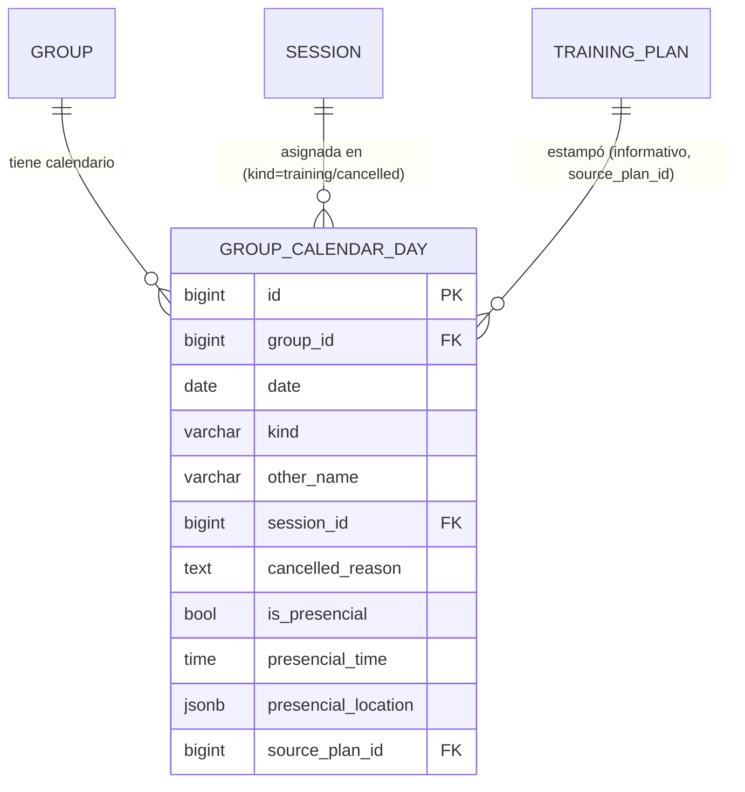

# Spec de backend — Calendario y asignación de planes a grupos

> Documento para el equipo de backend (Go/Gin, repo separado). Describe cómo un plan de entrenamiento del catálogo se traduce en el calendario real de un grupo, y todo lo que pasa alrededor de eso (edición atómica, sesiones presenciales, cancelaciones, clonado por divergencia). No sigue la convención fechada de `docs/superpowers/specs/` — vive junto a `BACKEND_API_GAPS.md`/`BACKEND_TRAINING_PLANS_SPEC.md` y se actualiza in-place.
>
> **Subproyecto hermano:** `docs/BACKEND_TRAINING_PLANS_SPEC.md` cubre el catálogo reusable (Exercise/Session/TrainingPlan/PlanDay) — léase primero, este documento asume ese modelo y no lo repite. Convenciones generales (formato de respuesta, auth, IDs, nombres) son las mismas que ahí — no se listan de nuevo acá.

## 1. Estado actual y por qué existe este documento

No existe ningún endpoint de calendario/asignación en el backend real — es dominio 100% nuevo, sin mock previo siquiera (a diferencia del catálogo, que corría contra mocks). El diseño reemplaza por completo un mecanismo anterior (`RunnerPlanAssignment` — asignación directa a un corredor individual, `CurrentPlanMark`, `Group.training_plan_id`) que había quedado documentado en `BACKEND_TRAINING_PLANS_SPEC.md` pero **nunca se implementó** — se descarta sin haber llegado a producción, no hace falta migración.

## 2. Decisión central: no hay una entidad "Assignment"

La asignación de un plan a un grupo **no es un registro con fecha de inicio/fin que haya que instanciar** — es, simplemente, el calendario del grupo. Un `GroupCalendarDay` por fecha con algo cargado. Consecuencias directas:

- Un corredor que se suma a un grupo no "recibe" una asignación — ve el calendario que ya existe, tal cual está, sin ciclo propio ni fecha de alta.
- Un plan "estampado" (drag del entrenador sobre el calendario) no queda como grupo rígido ligado al plan — copia sus datos día por día a filas de `GroupCalendarDay` normales, indistinguibles después de cualquier fila cargada a mano. El plan es un atajo de carga masiva, no una relación persistente.
- No hay "cuántas asignaciones tiene un corredor" como concepto — hay "de cuántos grupos es miembro", y cada uno tiene su propio calendario.

## 3. Entidades

### 3.1 `GroupCalendarDay` (tabla dispersa — sin fila = día vacío)

| Campo | Tipo | Nullable | Notas |
|---|---|---|---|
| `id` | bigint PK | no | |
| `group_id` | bigint FK → group | no | `ON DELETE CASCADE` |
| `date` | date | no | fecha real de calendario — **no** `sequence_no` (eso es del template, esto es el calendario en sí). `UNIQUE(group_id, date)` |
| `kind` | enum | no | `rest` \| `other` \| `training` \| `cancelled` |
| `other_name` | varchar | sí | obligatorio *solo* si `kind = 'other'` |
| `session_id` | bigint FK → session | sí | obligatorio si `kind = 'training'`. Si `kind` pasa a `cancelled`, **se mantiene** (contexto de qué sesión era) |
| `cancelled_reason` | text | sí | obligatorio *solo* si `kind = 'cancelled'` |
| `is_presencial` | bool | no, default `false` | solo tiene sentido si `kind = 'training'` o `'cancelled'` (una sesión cancelada puede haber sido presencial) |
| `presencial_time` | time | sí | 24h, obligatorio *solo* si `is_presencial = true` |
| `presencial_location` | jsonb `{lat, lng, label?}` | sí | mismo shape que `PlanDay.default_location` (ver `BACKEND_TRAINING_PLANS_SPEC.md` §3.5), obligatorio *solo* si `is_presencial = true` |
| `source_plan_id` | bigint FK → training_plan | sí | **informativo, no vinculante** — de qué plan vino el stamp que originó (o pisó) esta fila. `ON DELETE SET NULL` si se borra el plan. Nunca se usa para bloquear ediciones ni para "romper" el vínculo con el plan — ver §2 |
| `created_at` / `updated_at` | timestamptz | no | |

**Validación al guardar (crear/editar/estampar), servidor nunca confía solo en el frontend:**
- `kind = 'other'` ⇒ `other_name` no nulo.
- `kind = 'training'` ⇒ `session_id` no nulo, `other_name` y `cancelled_reason` nulos.
- `kind = 'cancelled'` ⇒ `cancelled_reason` no nulo. Solo se puede transicionar a `cancelled` **desde** `kind = 'training'` — cancelar un día de descanso o vacío no tiene sentido, `422`.
- `kind = 'rest'` ⇒ `other_name`, `session_id`, `cancelled_reason` nulos.
- `is_presencial = true` ⇒ `presencial_time` y `presencial_location` no nulos. `is_presencial = false` ⇒ ambos nulos (limpiar si se desmarca).

### 3.2 Shape de ubicación (`{lat, lng, label?}`)

Mismo shape en `PlanDay.default_location` y `GroupCalendarDay.presencial_location` — `lat`/`lng` numéricos (float), `label` opcional (varchar, texto libre que el entrenador puede escribir además del pin, ej. "Punto de encuentro — entrada norte"). No hay geocoding del lado del backend — el frontend resuelve la posición inicial vía GPS del dispositivo y el pin final vía el picker de mapa (OpenFreeMap/MapLibre, resuelto 100% en el cliente, sin dependencia de backend para los tiles en sí). El backend solo persiste el par de coordenadas + label, no valida que el punto "exista" en ningún sentido geográfico.

## 4. Endpoints

**Permisos (no cubierto por la tabla de convenciones general, se aclara acá porque es todo dato sensible/escribible):**
- `GET /groups/{id}/calendar` — el entrenador dueño del grupo, o cualquier corredor miembro (lectura). `403` para cualquier otro usuario autenticado.
- `PUT`/`DELETE`/`stamp`/`bulk`/`bulk-clear`/`shift` (todo lo que escribe) — **solo** el entrenador dueño del grupo. `403` para corredores, incluso miembros.
- `stamp` además valida que el `plan_id` sea del mismo `owner_id` que administra el grupo — `403` si el entrenador intenta estampar un plan que no es suyo.
- `/users/{id}/next-session` y `/users/{id}/calendar-summary` — `{id}` debe ser el propio usuario autenticado (del token), `403` si no coincide. Son endpoints de "mis datos", no una consulta abierta sobre cualquier `user_id`.

| Método | Path | Body | Respuesta |
|---|---|---|---|
| `GET` | `/groups/{id}/calendar?from={date}&to={date}` | — | `200` array de `GroupCalendarDay` en el rango (ambos límites inclusive, obligatorios — sin rango no se lista "todo" el calendario) |
| `PUT` | `/groups/{id}/calendar/{date}` | `{kind, other_name?, session_id?, cancelled_reason?, is_presencial?, presencial_time?, presencial_location?}` | `200` `GroupCalendarDay` — upsert de un día individual, valida §3.1 |
| `DELETE` | `/groups/{id}/calendar/{date}` | — | `204` — vacía el día (borra la fila, no un soft-delete) |
| `POST` | `/groups/{id}/calendar/stamp` | `{plan_id, start_date, force?}` | `201` array de `GroupCalendarDay` creados/reemplazados — copia cada `PlanDay` del plan a partir de `start_date` (día 1 del plan → `start_date`, día 2 → `start_date + 1`, etc.), incluyendo `default_presencial`/`default_time`/`default_location` si los tiene. Si algún día del rango ya tiene contenido y `force` no es `true`, responde `409` con la lista de fechas en conflicto (el frontend las muestra en el modal de confirmación) en vez de aplicar nada |
| `POST` | `/groups/{id}/calendar/bulk` | `{dates: [...], kind, session_id?, other_name?, is_presencial?, presencial_time?, presencial_location?}` | `200` array de `GroupCalendarDay` actualizados — multi-select bulk-assign, mismo `kind`/contenido a todas las fechas listadas, misma validación de §3.1 por cada una |
| `POST` | `/groups/{id}/calendar/bulk-clear` | `{dates: [...]}` | `204` — multi-select bulk-clear, borra las filas de esas fechas |
| `POST` | `/groups/{id}/calendar/shift` | `{from_date, days}` | `200` array de `GroupCalendarDay` con la fecha ya actualizada — todas las filas con `date >= from_date` pasan a `date + days`. `days` entero positivo, elegido por el entrenador (no fijo a 1). `409` si el corrimiento haría chocar dos fechas existentes (no debería pasar corriendo hacia adelante, pero se valida igual) |
| `GET` | `/users/{id}/next-session` | — | `200` `{group_id, date, session_id, is_presencial, presencial_time?, presencial_location?}` \| `204` si ninguno de sus grupos tiene una próxima `GroupCalendarDay` con `kind IN ('training','cancelled')` y `date >= hoy` — la primera cronológicamente entre TODOS sus grupos. Para el banner de "próximo entrenamiento" del home del corredor |
| `GET` | `/users/{id}/calendar-summary` | — | `200` array de `{group_id, group_name}` — un ítem por cada grupo del que es miembro, para poblar "Mis asignaciones" (cada ítem abre `GET /groups/{id}/calendar` filtrado). Sin paginación ni detalle embebido — la pantalla de detalle pega el `GET` de calendario aparte |

## 5. Editar una `Session` con asignaciones activas — clonado por divergencia

Una sesión asignada en el calendario de un grupo **mantiene referencia viva** al catálogo (`GroupCalendarDay.session_id`) — editar la sesión en el catálogo (`PUT /sessions/{id}`, ver `BACKEND_TRAINING_PLANS_SPEC.md` §4) actualiza automáticamente lo que ve cualquier grupo que la tenga asignada, salvo que el entrenador pida explícitamente lo contrario para algunos grupos.

**Flujo:**

1. Antes de mostrar el form de edición de una sesión, el frontend pide `GET /sessions/{id}/assigned-groups` → `200` array de `{group_id, group_name}` (distinct, de cualquier `GroupCalendarDay.session_id` = esa sesión, sin importar la fecha). Si viene vacío, edición normal, sin checklist.
2. Si no viene vacío, el frontend muestra el checklist (todos tildados por default) y el entrenador destilda 0+ grupos.
3. Al confirmar, `PUT /sessions/{id}` recibe 3 campos adicionales opcionales en su body — `{..., exclude_group_ids?: [...], clone_name?, clone_description?}`. `clone_name`/`clone_description` son **del `PUT`**, no del endpoint público `POST /sessions/{id}/clone` (que sigue sin body, ver doc de catálogo) — son la forma en que el frontend manda lo que el entrenador haya editado en los campos "nombre y descripción" del clon que se le muestran en el momento de destildar grupos.
   - Si `exclude_group_ids` viene vacío u omitido: `PUT` normal, todos los grupos ven el cambio (comportamiento ya descripto en el doc de catálogo). `clone_name`/`clone_description` se ignoran si vienen igual (no hay clon que crear).
   - Si trae ids, el backend, **antes** de aplicar el update:
     a. crea un clon de la sesión tal como está *antes* de este `PUT` (mismo mecanismo interno que `POST /sessions/{id}/clone`, pero con `name`/`description` = `clone_name`/`clone_description` si vinieron, o el sufijo default `" (copia)"` si no),
     b. hace `UPDATE GroupCalendarDay SET session_id = <clon.id> WHERE group_id IN (exclude_group_ids) AND session_id = {id}` (todas las fechas, no solo una),
     c. recién ahí aplica el resto del `PUT` (los campos normales de sesión) a la sesión original — la comparten los grupos que quedaron tildados (los no listados en `exclude_group_ids`) más el catálogo en general (nuevas asignaciones futuras).
   - Todo el paso 3 es una transacción — si el `PUT` final falla, se revierte también el clonado/repunteo.

**Un solo clon compartido**: si se destildan 3 grupos en la misma edición, los 3 pasan a apuntar al mismo clon nuevo (no 3 clones independientes).

## 6. Borrado de `Session` con calendarios activos

Mismo criterio que ya define `BACKEND_TRAINING_PLANS_SPEC.md` §5 (borrado lógico, `deleted_at`/`archived`, nunca `RESTRICT`/`CASCADE` físico) — una sesión borrada del catálogo activo debe seguir resolviendo correctamente en cualquier `GroupCalendarDay` que la referencie, pasada o futura. No hay reglas nuevas acá, solo la aclaración de que aplica igual a asignaciones de calendario, no solo a `SessionExercise`/`PlanDay`.

## 7. Fuera de alcance / decisiones diferidas

- **Tracking de completado**: el detalle de "Mis asignaciones" del corredor por ahora solo muestra el calendario (§4, `GET /groups/{id}/calendar`) — "cumplido/pendiente" y logros/estadísticas quedan sin mecanismo, a diseñar cuando se aborde tracking real de sesiones.
- **Monitoreo en tiempo real** de la ubicación de los participantes durante una sesión presencial (puntos en un mapa en vivo) — mencionado como idea a futuro por el usuario, no es parte de este diseño. Cuando se aborde, es un feature completamente distinto (streaming de ubicación, consentimiento/privacidad, vista de mapa en vivo), no una extensión de `presencial_location`.
- **Reuso del `LocationPicker`** para ubicación de equipo o de usuario (perfil) — el componente se construye pensado para ser reusable, pero ningún otro dominio lo consume todavía. No agregar columnas de ubicación a `Team`/`User` como parte de este trabajo.
- **Multi-sesión por día** — cada `GroupCalendarDay` tiene una sola sesión/actividad. Ya estaba anotado como pendiente desde el rediseño de catálogo, sigue diferido acá también.
- **Notificaciones** al estampar un plan, editar un día, o cancelar una sesión — ninguna todavía.
- **Concurrencia**: dos entrenadores editando el calendario del mismo grupo al mismo tiempo no tiene ningún mecanismo de lock — last-write-wins, aceptable para el tamaño de equipo actual.

## 8. Diagrama de relaciones

`GROUP`, `SESSION` y `TRAINING_PLAN` están definidos en `BACKEND_TRAINING_PLANS_SPEC.md` (y `GROUP` en el dominio de equipos, ya real) — no se repiten acá.
