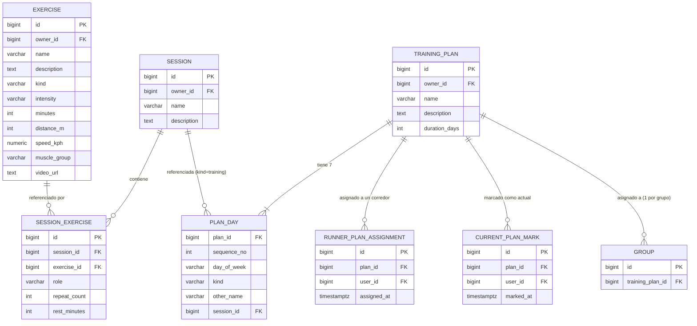

# Spec de backend — Planes de entrenamiento, Sesiones y Ejercicios

> Documento para el equipo de backend (Go/Gin, repo separado). Describe el dominio completo tal como lo modela y necesita el frontend hoy, para implementar los endpoints reales que hoy no existen (ver `docs/BACKEND_API_GAPS.md`, Gap 4). No es una spec de frontend — no sigue la convención fechada de `docs/superpowers/specs/`, vive junto a `BACKEND_API_GAPS.md`/`BACKEND_DEFINITIONS.md` y se actualiza in-place a medida que el diseño evolucione.

## 1. Estado actual y por qué existe este documento

Todo el módulo — planes, sesiones, ejercicios, asignación a grupos/corredores, "plan actual" — corre 100% contra mocks in-memory (`services/__mocks__/*.js`). `services/exercises.js`, `services/sessions.js` y `services/trainingPlans.js` ya tienen las rutas REST esperadas escritas (mismo estilo que `services/teams.js`, que sí es real), pero son inalcanzables: `USE_MOCKS` siempre gana porque no hay ningún endpoint real que probar. Este documento formaliza ese contrato ya especulado por el frontend, completándolo donde hacía falta (reglas de validación, tipos exactos, qué pasa al borrar algo referenciado).

**Nota de reconciliación** (para quien mire el historial de git del frontend y encuentre versiones contradictorias): el modelo descripto acá combina dos cambios que se hicieron en ramas separadas y **nunca convivieron en una sola rama del frontend**:
- El modelo de **Sesión** con lista libre de ejercicios y rol por ejercicio (en vez de 3 bloques fijos) viene de la rama `feature/session-exercises-rework`.
- El modelo de **Ejercicio** con `description` obligatoria e `intensity` opcional (independiente del tipo) viene de la rama `feature/exercise-name-auto-compose`.

Ambas ramas seguían sin mergear a `develop` (ni entre sí) al momento de escribir esto. Lo que sigue es el diseño combinado — la versión realmente vigente del dominio — no lo que hoy corre en `develop`.

## 2. Convenciones a respetar

Ya establecidas por los dominios reales existentes (equipos, usuarios, tiers) — este dominio nuevo debe seguir el mismo estilo, no inventar uno propio:

| Convención | Detalle |
|---|---|
| Prefijo de ruta | `/api/v1/...` (parte de la base URL, no se repite en cada path de este documento) |
| Auth | Header `Authorization: Bearer <token>` en todos los endpoints |
| Formato de respuesta | JSON plano — un listado devuelve un array directo (`[ {...}, {...} ]`), sin envelope tipo `{data: [...]}` |
| Paginación | Ninguna — los listados devuelven todo, filtrable por un query param simple (`owner_id`, `user_id`, etc.) |
| Errores | Body `{ "message": "..." }` + status code semántico (`404` no encontrado, `422` violación de regla de negocio, `400` payload inválido) |
| IDs | Numéricos (`bigint`/`SERIAL`), no UUID — consistente con todo el resto del dominio |
| Nombres | DTO en `snake_case`, el frontend normaliza a `camelCase` (`services/normalizers.js`, mismo patrón `toXModel`/`toCreateXPayload` ya usado por equipos/tiers/pagos) |
| Timestamps | `created_at`/`updated_at` en toda entidad de nivel superior, formato ISO 8601 |

## 3. Entidades

### 3.1 `Exercise`

| Campo | Tipo | Nullable | Notas |
|---|---|---|---|
| `id` | bigint PK | no | |
| `owner_id` | bigint FK → user | no | el entrenador dueño del catálogo |
| `name` | varchar | no | texto libre |
| `description` | text | **no** | único campo de texto obligatorio junto con `name` — ver §6, se decidió deliberadamente no derivarlo de las características |
| `kind` | enum | no | `walking` \| `jogging` \| `elongation` \| `cruising` \| `running` |
| `intensity` | enum | sí | `light` \| `moderate` \| `vigorous` — **independiente del `kind`**, cualquier tipo puede tener cualquier intensidad o ninguna |
| `minutes` | int | sí | |
| `distance_m` | int | sí | metros |
| `speed_kph` | numeric(4,1) | sí | km/h |
| `muscle_group` | enum | sí | `cuadriceps` \| `isquiotibiales` \| `gemelos` \| `gluteos` \| `aductores` \| `psoas` \| `lumbares` \| `core` |
| `video_url` | text | sí | reservado a futuro, hoy siempre `null` — no migrar el shape cuando se implemente |
| `created_at` / `updated_at` | timestamptz | no | |

**Regla de negocio clave — nada de esto depende del `kind`**: `intensity`, `minutes`, `distance_m`, `speed_kph` y `muscle_group` son **todos opcionales y válidos para cualquier tipo**, sin ninguna combinación obligatoria u prohibida por `kind`. Se llegó a esto después de intentar (y descartar) mapear qué campo corresponde a cada tipo — terminaba siendo más complejidad de la que valía dado lo variado que es un ejercicio real. El backend no debe agregar sus propios CHECK constraints acoplando `kind` a estos campos.

### 3.2 `Session`

| Campo | Tipo | Nullable | Notas |
|---|---|---|---|
| `id` | bigint PK | no | |
| `owner_id` | bigint FK → user | no | |
| `name` | varchar | no | |
| `description` | text | sí | a diferencia de `Exercise.description`, acá es opcional |
| `created_at` / `updated_at` | timestamptz | no | |

### 3.3 `SessionExercise` (tabla propia, no un array embebido)

| Campo | Tipo | Nullable | Notas |
|---|---|---|---|
| `id` | bigint PK | no | |
| `session_id` | bigint FK → session | no | `ON DELETE CASCADE` (si se borra la sesión, se borran sus filas de esta tabla) |
| `exercise_id` | bigint FK → exercise | no | ver §5 sobre qué pasa si se borra el ejercicio referenciado |
| `role` | enum | no | `warmup` \| `main` \| `cooldown` |
| `repeat_count` | int | no, default `1` | `1` = "una sola vez" |
| `rest_minutes` | int | no, default `0` | |

**Regla de negocio clave**: una sesión puede tener **cualquier cantidad de ejercicios por rol** (no es 1 slot fijo por rol) — la única regla es que al guardar debe haber **al menos 1 ejercicio de cada uno de los 3 roles**. El orden de las filas dentro de un `role` no tiene un campo explícito de posición — el frontend siempre reenvía la lista completa en el orden que quiere mostrar, así que **`PUT` reemplaza el conjunto entero de `SessionExercise` de esa sesión**, no lo parchea fila por fila; conviene preservar el orden de inserción del array recibido (ej. autoincremental `id` como desempate de orden).

### 3.4 `TrainingPlan`

| Campo | Tipo | Nullable | Notas |
|---|---|---|---|
| `id` | bigint PK | no | |
| `owner_id` | bigint FK → user | no | el entrenador dueño — el plan es reusable/asignable a cualquiera de sus equipos/grupos/corredores, no pertenece a un equipo |
| `name` | varchar | no | |
| `description` | text | sí | |
| `created_at` / `updated_at` | timestamptz | no | |

**Sin caducidad propia** (decisión 2026-09-10, reemplaza el modelo
anterior de `duration_days` 7/14 con `status` derivado) — un plan es un
template puro, reusable indefinidamente. La noción de "vigencia" pasa
a resolverse en la futura capa de asignación/calendario (fuera de
alcance de este documento), no en el plan en sí.

### 3.5 `PlanDay` (entre 2 y 31 filas por plan, tabla propia)

| Campo | Tipo | Nullable | Notas |
|---|---|---|---|
| `plan_id` | bigint FK → training_plan | no | `ON DELETE CASCADE` |
| `sequence_no` | int | no | `1`..`N`, `N` = cantidad de días del plan (entre 2 y 31) |
| `kind` | enum | no | `rest` \| `other` \| `training` |
| `other_name` | varchar | sí | obligatorio *solo* si `kind = 'other'` |
| `session_id` | bigint FK → session | sí | obligatorio *solo* si `kind = 'training'` |

**Sin `day_of_week`** (decisión 2026-09-10) — un plan-template ya no se
ata a un día real de la semana; los días son puramente secuenciales
(`sequence_no`). Esto reemplaza el modelo anterior de exactamente 7
filas, una por cada día de la semana.

**Validación al crear/editar un plan** (ya implementada del lado mock,
el backend debe re-validarla, nunca confiar solo en el frontend):
- Entre 2 y 31 filas.
- `sequence_no` cubre `1..N` sin repetidos, donde `N` es la cantidad de
  filas.
- `kind = 'training'` ⇒ `session_id` no nulo (y `other_name` nulo).
- `kind = 'other'` ⇒ `other_name` no nulo (y `session_id` nulo).
- `kind = 'rest'` ⇒ ambos nulos.

### 3.6 Asignación — dos mecanismos distintos, no uno unificado

**`RunnerPlanAssignment`** (relación real, corredor individual):

| Campo | Tipo | Nullable | Notas |
|---|---|---|---|
| `id` | bigint PK | no | |
| `plan_id` | bigint FK → training_plan | no | |
| `user_id` | bigint FK → user | no | **`UNIQUE`** — un corredor tiene a lo sumo 1 asignación individual activa; asignarle un plan nuevo reemplaza la anterior (upsert por `user_id`, no acumula filas) |
| `assigned_at` | timestamptz | no | |

**`Group.training_plan_id`** (campo simple en la entidad `Group` ya existente, **no** una tabla de relación aparte):

| Campo | Tipo | Nullable | Notas |
|---|---|---|---|
| `training_plan_id` | bigint FK → training_plan | sí | columna nueva a agregar al `Group` ya real — 1 plan por grupo, asignar uno nuevo reemplaza (no apila). El frontend (`toGroupModel`) ya trae este campo mapeado del lado del modelo, siempre en `null` hasta hoy porque no existe en el backend. |

Un corredor puede ver simultáneamente el plan de su grupo Y su asignación individual (el frontend compone ambas fuentes, deduplicadas por `plan_id`) — no son excluyentes.

### 3.7 `CurrentPlanMark` ("plan actual" — preferencia del corredor, no la asignación en sí)

| Campo | Tipo | Nullable | Notas |
|---|---|---|---|
| `id` | bigint PK | no | |
| `plan_id` | bigint FK → training_plan | no | |
| `user_id` | bigint FK → user | no | |
| `marked_at` | timestamptz | no | |

`UNIQUE(plan_id, user_id)`. **Tope de 2 marcas por `user_id`**, validado del lado del servidor (rechazar la 3ra marca de un plan *distinto* con `422`; volver a marcar un plan que el usuario ya tiene marcado es un no-op idempotente, no un error). Es una preferencia sobre cuáles de los planes ya asignados destacar — no cambia ni reemplaza `RunnerPlanAssignment`/`Group.training_plan_id`.

## 4. Endpoints

### Exercise

| Método | Path | Body | Respuesta |
|---|---|---|---|
| `GET` | `/exercises?owner_id={id}` | — | `200` array de `Exercise` |
| `GET` | `/exercises/{id}` | — | `200` `Exercise` \| `404` |
| `POST` | `/exercises` | `{owner_id, name, description, kind, intensity?, minutes?, distance_m?, speed_kph?, muscle_group?}` | `201` `Exercise` |
| `PUT` | `/exercises/{id}` | igual shape que `POST` | `200` `Exercise` \| `404` — reemplazo completo, el frontend siempre manda el form entero |
| `DELETE` | `/exercises/{id}` | — | `204` \| `404` — ver §5, no bloquear por estar en uso |

### Session

| Método | Path | Body | Respuesta |
|---|---|---|---|
| `GET` | `/sessions?owner_id={id}` | — | `200` array de `Session` (con `exercises` embebido en la respuesta) |
| `GET` | `/sessions/{id}` | — | `200` `Session` \| `404` |
| `POST` | `/sessions` | `{owner_id, name, description?, exercises: [{exercise_id, role, repeat_count?, rest_minutes?}]}` | `201` `Session` — validar ≥1 ejercicio por rol (§3.3) |
| `PUT` | `/sessions/{id}` | igual shape | `200` `Session` \| `404` — `exercises` reemplaza el conjunto entero |
| `DELETE` | `/sessions/{id}` | — | `204` \| `404` — ver §5 |

### TrainingPlan

| Método | Path | Body | Respuesta |
|---|---|---|---|
| `GET` | `/training-plans?owner_id={id}` | — | `200` array de `TrainingPlan` (con `days` embebido) |
| `GET` | `/training-plans/{id}` | — | `200` `TrainingPlan` \| `404` |
| `POST` | `/training-plans` | `{owner_id, name, description?, duration_days, days: [...7]}` | `201` — validar §3.5 |
| `PUT` | `/training-plans/{id}` | parcial — solo las claves presentes se actualizan; si viene `days`, debe ser el set de 7 completo y válido de nuevo | `200` \| `404` |
| `DELETE` | `/training-plans/{id}` | — | `204` \| `404` — **cascada**: borrar toda `RunnerPlanAssignment`/`CurrentPlanMark` de este plan y limpiar cualquier `Group.training_plan_id` que apunte acá |
| `POST` | `/training-plans/{id}/clone` | — | `201` nuevo `TrainingPlan` (mismo `owner_id`, copia profunda de `days`) — **no** copia asignaciones ni marcas, el clon nace sin asignar |
| `GET` | `/training-plans/assignments?user_id=&plan_id=` | — | `200` array de `RunnerPlanAssignment` (ambos filtros opcionales) |
| `POST` | `/training-plans/{id}/assignments` | `{user_id}` | `201` — reemplaza cualquier asignación previa de ese `user_id` |
| `DELETE` | `/training-plans/assignments/{user_id}` | — | `204` |
| `GET` | `/training-plans/current-marks?user_id=` | — | `200` array de `CurrentPlanMark` |
| `POST` | `/training-plans/{id}/current-marks` | `{user_id}` | `201` \| `422` si ya tiene 2 marcas de planes distintos (marcar de nuevo el mismo plan es no-op `200`) |
| `DELETE` | `/training-plans/{id}/current-marks/{user_id}` | — | `204` |

### Group (endpoint ya real, solo agrega un campo)

| Método | Path | Body | Notas |
|---|---|---|---|
| `PATCH`/`PUT` | `/groups/{id}` (el que ya exista) | agregar `training_plan_id` (nullable) al set de campos aceptados | `null` para desasignar |

## 5. Borrar algo que está referenciado en otro lado

El frontend **permite** borrar un `Exercise`/`Session` en uso (con una confirmación que lista dónde se usa, no un bloqueo duro — ver `docs/superpowers/specs/2026-09-03-exercises-sessions-catalog-design.md`). Esto es distinto de borrar un `TrainingPlan` (§4, cascada explícita hacia asignaciones/marcas). Para `Exercise`/`Session`, **no se recomienda un DELETE físico con `ON DELETE RESTRICT`** (rompería el flujo ya decidido del frontend) ni `CASCADE`/`SET NULL` silencioso (corrompería sesiones/planes existentes sin avisar). Recomendación: **borrado lógico** (`deleted_at`/`archived` en `Exercise`/`Session`) — el catálogo activo filtra por no-borrado, pero las filas siguen resolviendo correctamente en sesiones/planes ya creados que las referencian. Queda como decisión abierta del equipo de backend, no algo que el mock actual resuelva bien (hoy simplemente filtra el array en memoria, sin backend real detrás).

## 6. Fuera de alcance / decisiones diferidas

Ya señaladas en las specs de frontend, documentadas acá para que el backend no las de por sentado:
- Unidad de `speed_kph` — hoy siempre km/h, se evaluó y descartó introducir min/km para no arriesgar bugs de parseo.
- `holdSeconds` (segundos de sostenimiento) para ejercicios de elongación — no existe todavía.
- Carga real de `video_url` (foto/video del ejercicio) — el campo existe reservado, sin flujo de subida.
- Versionado de plan al editar — editar un plan afecta a todos los que ya lo tienen asignado/marcado, no hay snapshot por asignación.
- Notificaciones al asignar un plan, o al desasignar.
- Tracking de progreso/completado de una sesión o un día.
- Por qué `Exercise.description` es obligatoria pero no se deriva de `kind`/`intensity`/etc.: se probó (y se descartó) un nombre 100% auto-compuesto por características — terminaba siendo más complejidad de la que valía dado lo variado que es un ejercicio real; se volvió a texto libre para `name` y se sumó `description` como el lugar para contexto adicional.

## 7. Diagrama de relaciones

